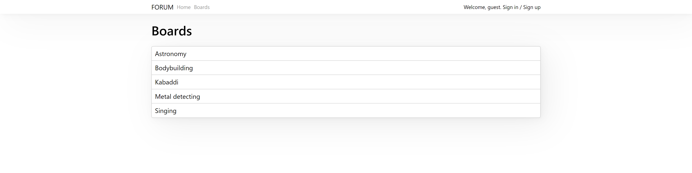
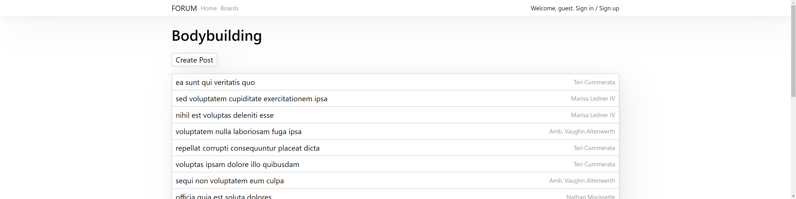
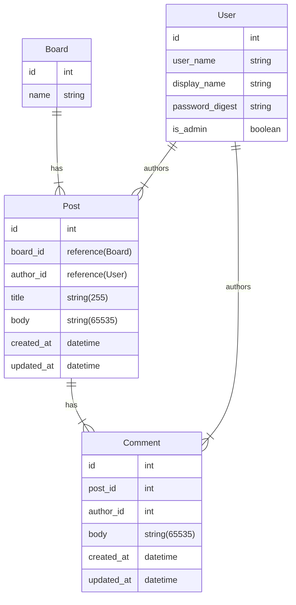

# Forum

## Screenshots

## ER Diagram

```mermaid
erDiagram
    Board {
        id int
        name string
    }

    User {
        id int
        user_name string
        display_name string
        password_digest string
        is_admin boolean
    }

    Post {
        id int
        board_id reference(Board)
        author_id reference(User)
        title string(255)
        body string(65535)
        created_at datetime
        updated_at datetime
    }

    Comment {
        id int
        post_id int
        author_id int
        body string(65535)
        created_at datetime
        updated_at datetime
    }

    User ||--|{ Post : "authors"
    Board ||--|{ Post : "has"
    Post ||--|{ Comment : "has"
    User ||--|{ Comment : "authors"
```
